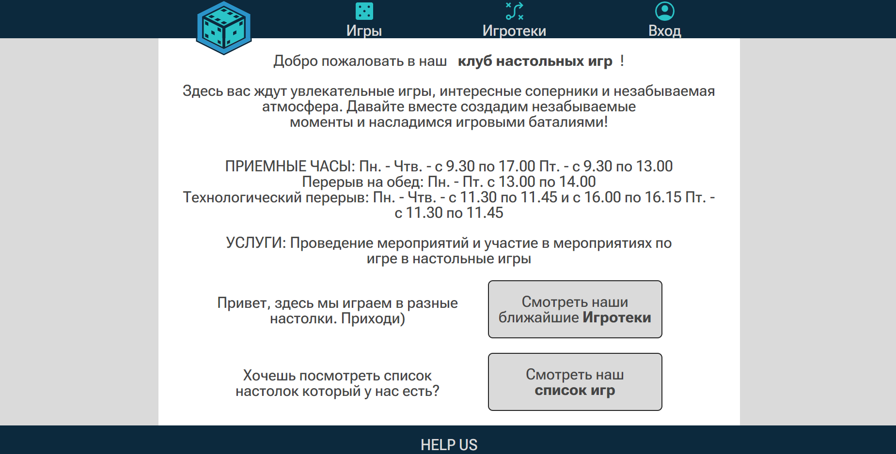
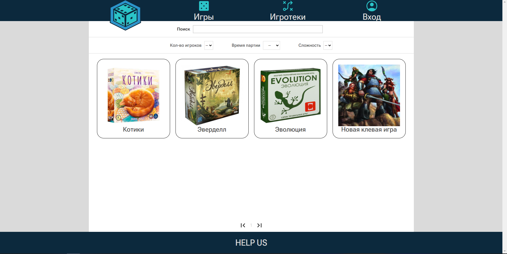
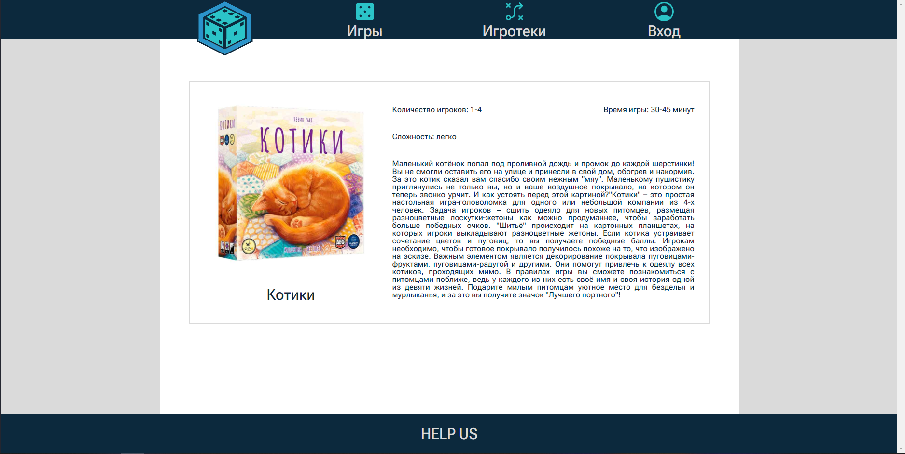
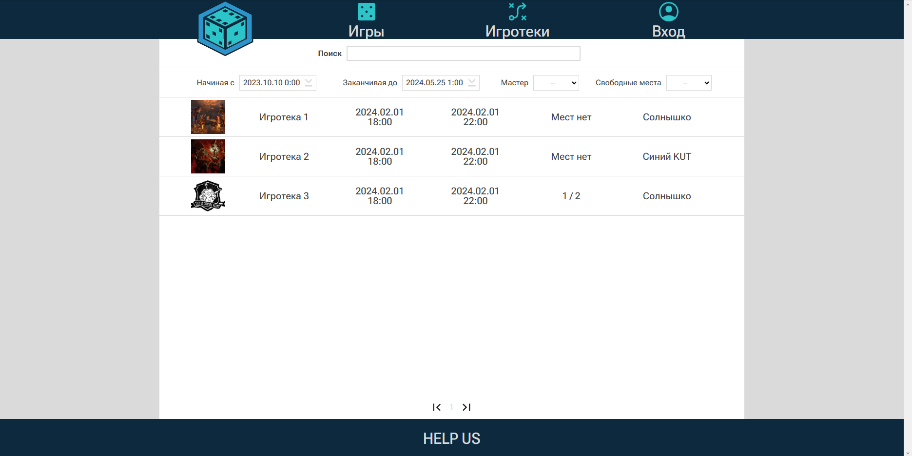
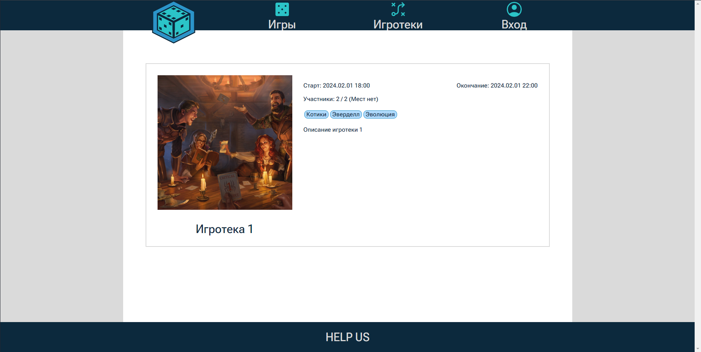
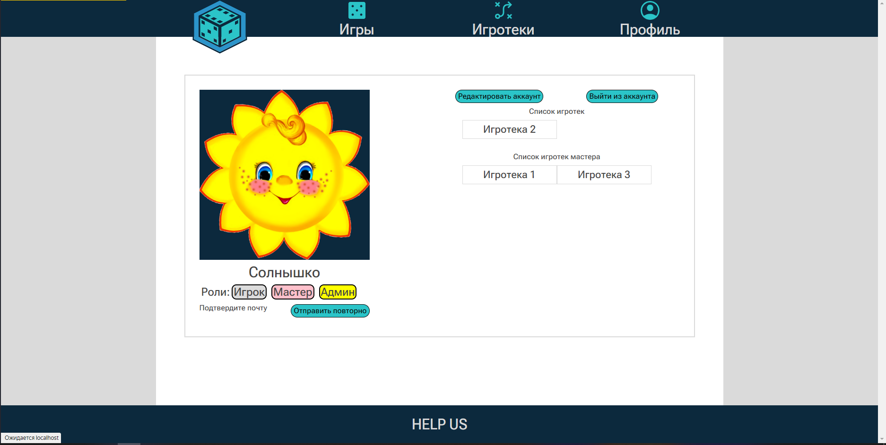

<h1 style="text-align: center;">SADR</h1>
<h4>Это наш клевый сайт с настолками и игротеками

 

Здесь уже можно:

 

<ui>

<li>Познакомиться с нами</li>

 

<li>Смотреть наши настолки</li>

 

<li>И даже посмотреть на них поближе</li>

 

<li>Смотреть наши игротеки</li>

 

<li>Узнать о них подробнее</li>

 

<li>Создать новый профиль и влиться в наш дружный коллектив</li>

 

<li>Добавить игру (если Вы админ) или игротеку (если Вы мастер), изменить ее</li>

 

<li>И увидеть плоды рук своих</li>

 

</ui>

</h4>

<h1>Что еще можно сделать</h1>
<h2>
  <ui>
    <li>Доработать редактирование админа</li>
    <li>Добавить комменты</li>
    <li>Добавить админскую панель</li>
    <li>Добавить мастерскую панель</li>
  </ui>
</h1>
