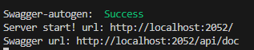
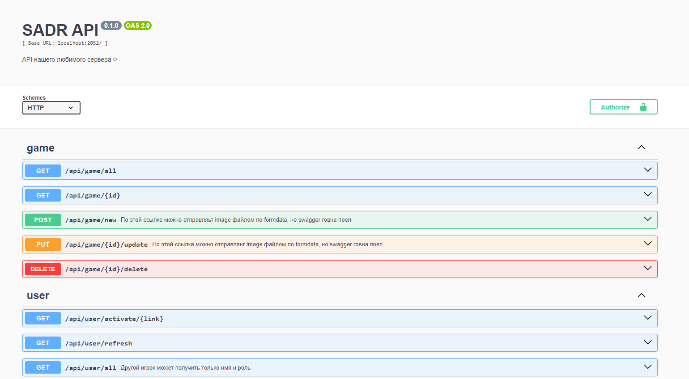

<h3>Подготовка к запуску сервера:</h3>
<pre>
<code>cd server
npm i</code>
</pre>
В файле <code>./node_modules/express-fingerprint/lib/index.js </code>
 
Изменить строку 
<code>req.fingerprint = fingerprint;</code>
 
На строку 
<code>req.body.fingerprint = fingerprint;</code>

 
 
<h3>Это должно быть в файле <code>tokens.json</code> в корне проекта</h3>
<pre>
{
    "DATABASE": {
        "USER_NAME": "",
        "USER_PASSWORD": "",
        "BASE_NAME": "",
        "PORT": ,
        "HOST": "localhost"
    },
    "TOKENS_KEYS": {
        "SECRET_ACCESS_KEY": "",
        "SECRET_REFRESH_KEY": ""
    },
    "MAIL_DATA": {
        "HOST": "smtp.yandex.ru",
        "PORT": 465,
        "USER_MAIL": "lubiteli.nastolok@yandex.ru",
        "USER_PASSWORD": "sxdfxpwbdmkqqypt"
    },
    "SERVER_URL": "http://5.144.98.35:2052",
    "CLIENT_URL": "http://5.144.98.35:2051",
    "MAX_SESSIONS": 2
}
</pre>

*В MAIL_DATA USER_PASSWORD это не пароль от почты, а спец токен от почты для приложения. В яндексе подключается как все настроки включить smdp или чота так
 
Я пока оставлю временный пароль от своей почты, можем потом поменять ее

<h3>Запус сервера:</h3>
<pre>
--Для обычного запуска
<code>npm start</code>
--Для запуска нодемоном, при каждом изменении он перезагружается
<code>npm test</code>
</pre>

<h3>Swagger</h3>
После запуска проекта в консоль выводится ссылка на swagger

В него можно потыкать. Секретные запросы на сервере пока не доделаны